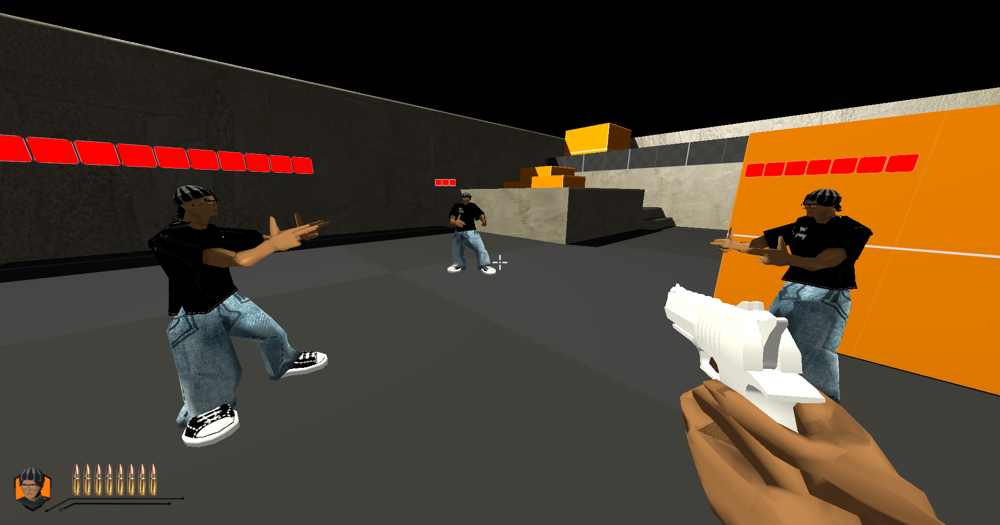
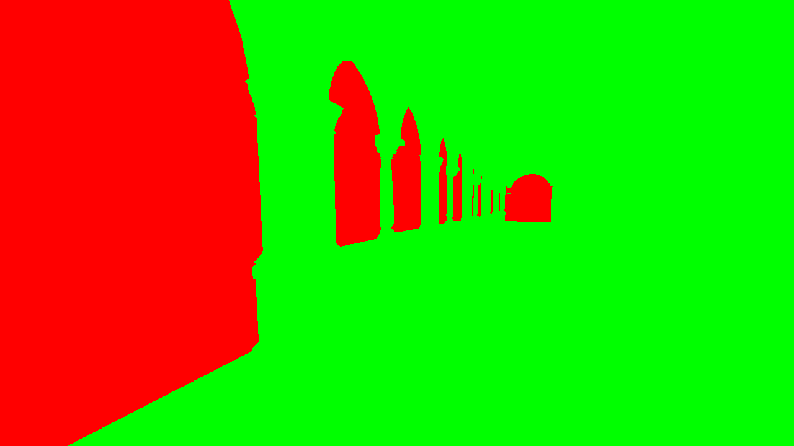
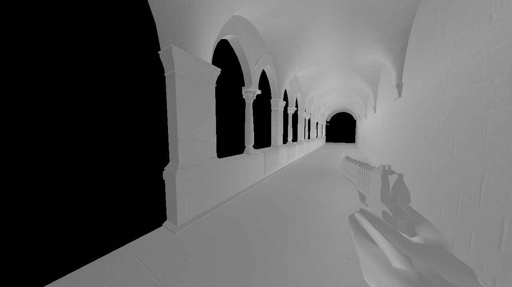
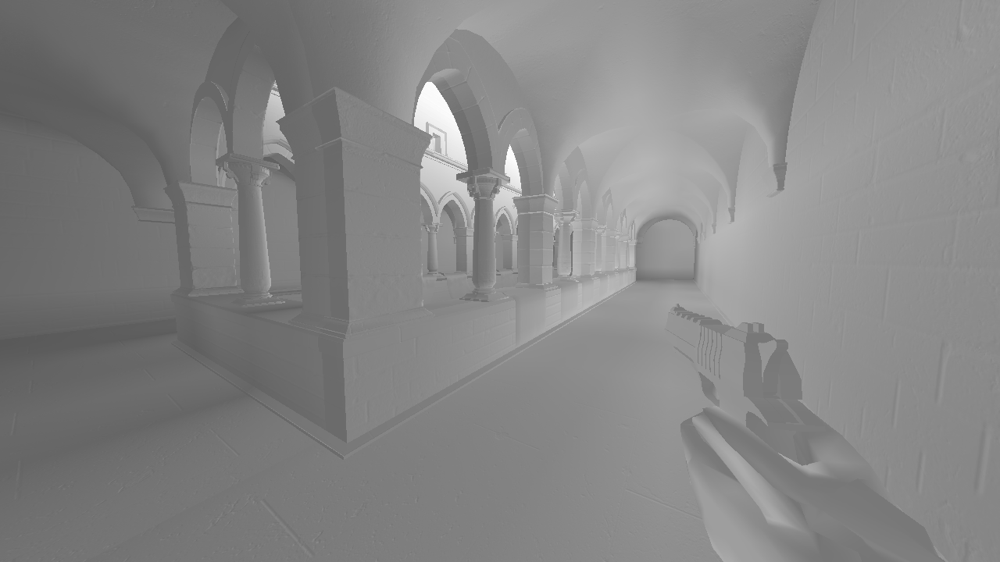
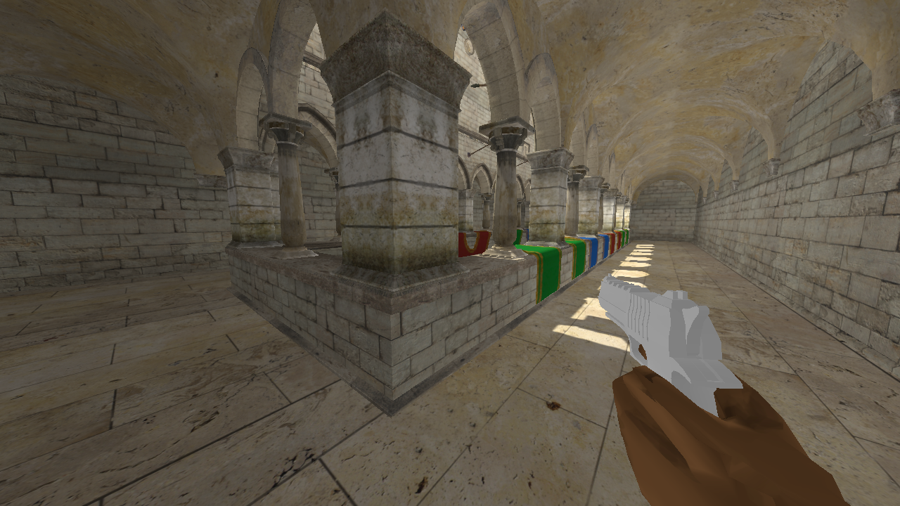

# 🪻 HYACINTH    
  

Hyacinth is a deferred-rendered multiplayer first-person shooter engine made in C++ using Vulkan and PhysX.

# 📽️ Demo 
Hyacinth v0 is out! View some demo clips here: https://www.youtube.com/watch?v=YgR1PEGyKbY

# 🔥 Feature Highlights
## Authoritative Game Server
Multiplayer is enabled through an authoritative game server, engineered based off of netcode from popular FPS titles, including Valorant, Overwatch, and CS:GO. The server handles all communication over UDP, and features:

- multithreading (separating game loop and render loop)
- synchronization & deterministic physics
- entity interpolation
- client prediction / server reconciliation
- lag compensation

For more information on my server architecture, you can view my blog at: https://ajnkrishnan.me/blog-posts/hyacinth-server-architecture.html
## Baked DDGI
This whole project started after I watched this talk from Will Pearce, a graphics engineer on the Overwatch team: https://www.youtube.com/watch?v=0PlxPCq-DbQ. I've always been super interested in the Overwatch rendering style, and this would be a step towards recreating that look.

Overwatch uses a volume-based DDGI approach, where smaller volumes allow for more detailed global illumination. Everything else follows the standard Nvidia implementation of DDGI. To enhance performance of this multi-volume system, Overwatch uses stencil buffers and discard instructions to ensure that the global illumination is only evaluated once per pixel. They use two bits in the stencil buffer pass, a "current" bit, and an "any" bit. GI Evaluation goes something like this:

For each volume:
	1. Draw the volume bounds to the stencil buffer. In the fragment shader, determine if the world space position is inside the volume. If not, discard the pixel.
	2. Volume pass tests against the "any" bit. Sets "current" to 1 if passed.
	3. GI Evaluation pass tests against the "current" bit. If "current" bit is set, "any" is not set. So, invert the "any" bit and "current" bits if passed, and unset both if fail. 
	4. All pixels passing the "current" bit stencil test get written to a GI image that gets composited later on.

This is my stencil pass setup:

```m_volumeStencilPipeline.m_depthStencil.stencilTestEnable = true;
m_volumeStencilPipeline.m_depthStencil.front.compareMask = ANY_BIT;
m_volumeStencilPipeline.m_depthStencil.front.writeMask = CURRENT_BIT;
m_volumeStencilPipeline.m_depthStencil.front.compareOp = VK_COMPARE_OP_EQUAL;
m_volumeStencilPipeline.m_depthStencil.front.reference = 1;
m_volumeStencilPipeline.m_depthStencil.front.passOp = VK_STENCIL_OP_REPLACE;
m_volumeStencilPipeline.m_depthStencil.front.failOp = VK_STENCIL_OP_KEEP;
```

and this is my evaluation pass setup:

```m_ddgiPipelineUtil.m_depthStencil.stencilTestEnable = true;
m_ddgiPipelineUtil.m_depthStencil.front.compareMask = CURRENT_BIT;
m_ddgiPipelineUtil.m_depthStencil.front.writeMask = ANY_BIT | CURRENT_BIT;
m_ddgiPipelineUtil.m_depthStencil.front.compareOp = VK_COMPARE_OP_EQUAL;
m_ddgiPipelineUtil.m_depthStencil.front.reference = 1;
m_ddgiPipelineUtil.m_depthStencil.front.passOp = VK_STENCIL_OP_INVERT;
m_ddgiPipelineUtil.m_depthStencil.front.failOp = VK_STENCIL_OP_ZERO;
```

You can see below, with a small volume enclosing only the top windowed corridor of sponza.

|                                   stencil pass                           |                     ddgi evaluation                                      |
| :----------------------------------------------------------------------: | :----------------------------------------------------------------------: |
|                                            |                                                 |

|                                   full ddgi eval                         |                         final color                                      |
| :----------------------------------------------------------------------: | :----------------------------------------------------------------------: |
|                                               |                                              |

## Locomotion
The hierarchical nature of my gltf loading means that I am able to generate procedural animations by editing the transforms of parent bones, and having that change propagate along child bones. By implementing my own version of a bone mask, I am also able to split my armatures into an upper/lower body, and animate those individually. 

By keeping track of the shoulder and neck bones, I can modulate them with the camera's pitch and yaw values to make it so that the character is always facing the direction that the camera is pointing. For the lower body, I maintain a basis quaternion, and calculate the yaw angle difference between the basis and the camera's yaw. If that angle exceeds 90 degrees in either direction, it plays a turning animation and lerps the basis quaternion towards the new basis direction. The upper body yaw angle is then determined by that interpolated basis and the camera's current world yaw.

https://github.com/user-attachments/assets/2e9d6ad5-6c81-4151-86ed-96d7d9df83c7

# Credits:
Gun model: https://www.cgtrader.com/free-3d-models/military/gun/stylized-gun
